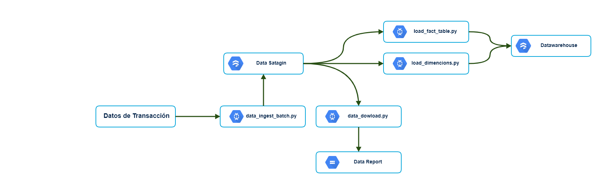

# Prueba Tecnica Conekta

Prueba tecnica - Data Engineer.pdf
##### Objetivo: 
Crear un data pipeline con las herramientas disponibles por el usuario
Los ejercicios de programación tienen que incluir los procedimientos de instalación y ejecución
de las herramientas a utilizar y los scripts que realizaran los procedimientos.

### Pre-Requisitos

* python3.7
* docker
* postgresql 11
* (opcional) para data discovery jupyterNotebook 


### Instalaci&oacute;n

Para la instalacion es necesario ejecutar el archivo sh
```
sh ./activate.sh
```


### Detalle de la soluci&oacute;n
-  1.1 Carga de información : Se realiza la carga por medio de la herramienta apache beam a la base de datos mongo debido a que es una base de datos nosql mas flexible y con la capacidad de guardar la informaci&oacute;n sin generar transformaciones.

- 1.2 Extracción : Para este proceso se realizo un script en apache beam con la finalidad de poder extraer la informaci&oacute;n en un archivo se utilizo la herramienta beam de forma declarativa para que sea capaz de procesar grandes voumenes de datos en un cluster de procesamiento y tambien el poder almacenarlo en archivo parquet (sistema de archivo recomendado por cloudera para reducir espacio y mejorar performance) y poder ser distribuido de manera universal. 
```
gs:// (para gcp)  |  hdfs:// para hadoop 
``` 

- 1.3 , 4  Transformación : En este paso se planifico el poder hacer dos lineas de procesamiento, debido a que la db de destino es SQL lo que se recomienda es un modelo de tipo estrella, para  poder customizar en postgreSQL con el motor de (analytic engine). Proceso de dimenciones y tabla de hechos. Los retos encontrados es la mala calidad de los datos (numeros infinitos , numeros muy extensos , transacciones sin ids, catalogo duplicados y mal escritos)

- 1.5  Dispersión de la información : 
se creo una tabla con los resultados mostrando distintas variantes


#### Porque apache beam?

- Porque se puede realizar un proceso de tipo batch y stream en un solo script.
- Puede correr en multiples motores (spark , flink , dataflow , samza)


##### Modelo de solucion en  Google Cloud Patfomr


##### Modelo de solucion en servicios dispersos 


## Autor
* **Oscar Ramirez**
